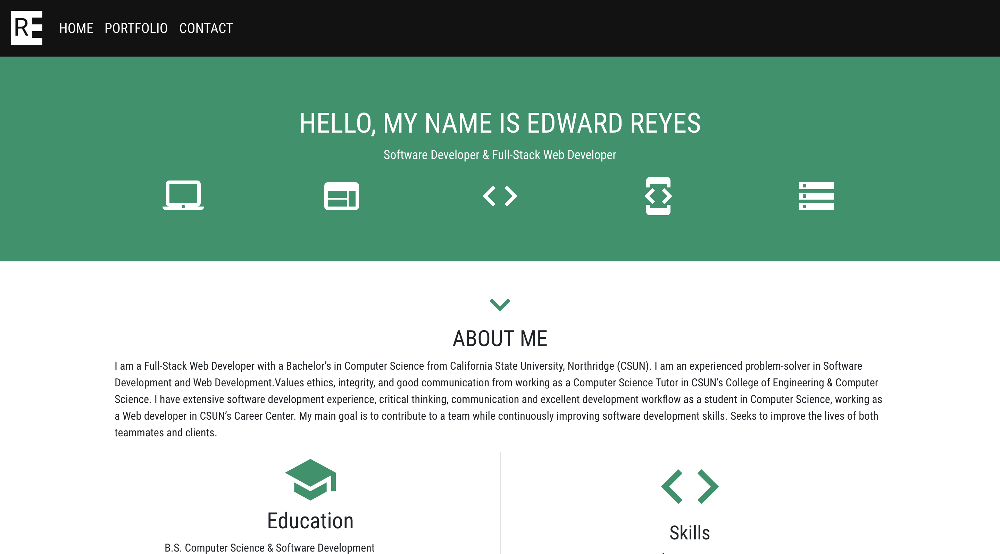
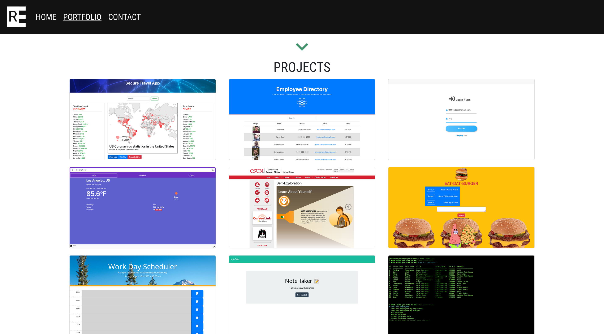
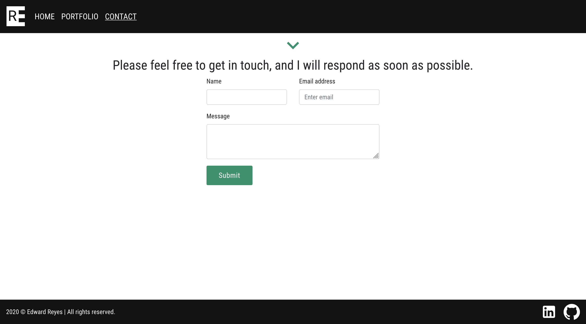

# Portfolio

## AUTHOR

Edward Reyes

## About me
I am a Full-Stack Web Developer with a Bachelor’s in Computer Science from California State University, Northridge (CSUN). I am an experienced problem-solver in Software Development and Web Development.Values ethics, integrity, and good communication from working as a Computer Science Tutor in CSUN’s College of Engineering & Computer Science. I have extensive software development experience, critical thinking, communication and excellent development workflow as a student in Computer Science, working as a Web developer in CSUN’s Career Center. My main goal is to contribute to a team while continuously improving software development skills. Seeks to improve the lives of both teammates and clients.

[Vist my site!](https://edwardreyes29.github.io/)

## Description (Update)
My portfolio is now deployed using React.js.

## Site information Display
* Home page that changes background color every 8 seconds (home page only)
* About me
* My projects
* Contact form

## Technologies
* React
* Materlize-UI
* React Bootstrap

### Technologies used:  
HTML, CSS, Bootstrap, JavaScript, jQuery

